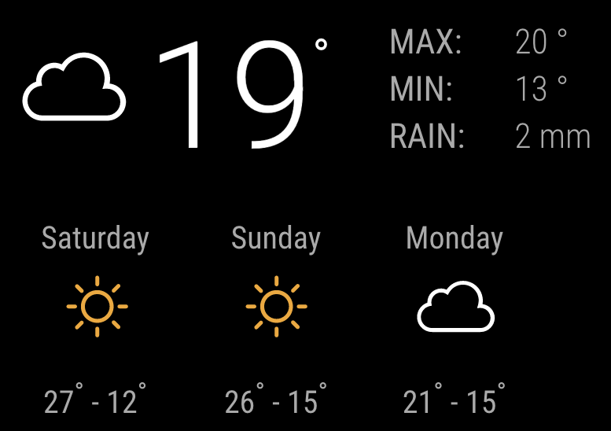

Weather is a simple weather module for [looking glass](http://github.com/glasslabs/looking-glass)



## Usage

Add the configuration as shown below to your configuration:

```yaml
modules:
 - name: simple-weather
   path: github.com/glasslabs/weather
   version: latest
   position: top:right
   config:
     locationId: 1234
     appId: {{ .Secrets.weather.appId }}
     units: metric
```

## Configuration

### Location ID (locationId)

*Required*

The location ID for your location from [OpenWeather](https://openweathermap.org/find).

### App ID (appId)

*Required*

The Application ID from [OpenWeather](https://openweathermap.org).

### Units (units)

*Required*

The temperature units to display (`metric` or `imperial`).

### Interval (interval)

*Default: 30m*

The interval to refresh the weather data.